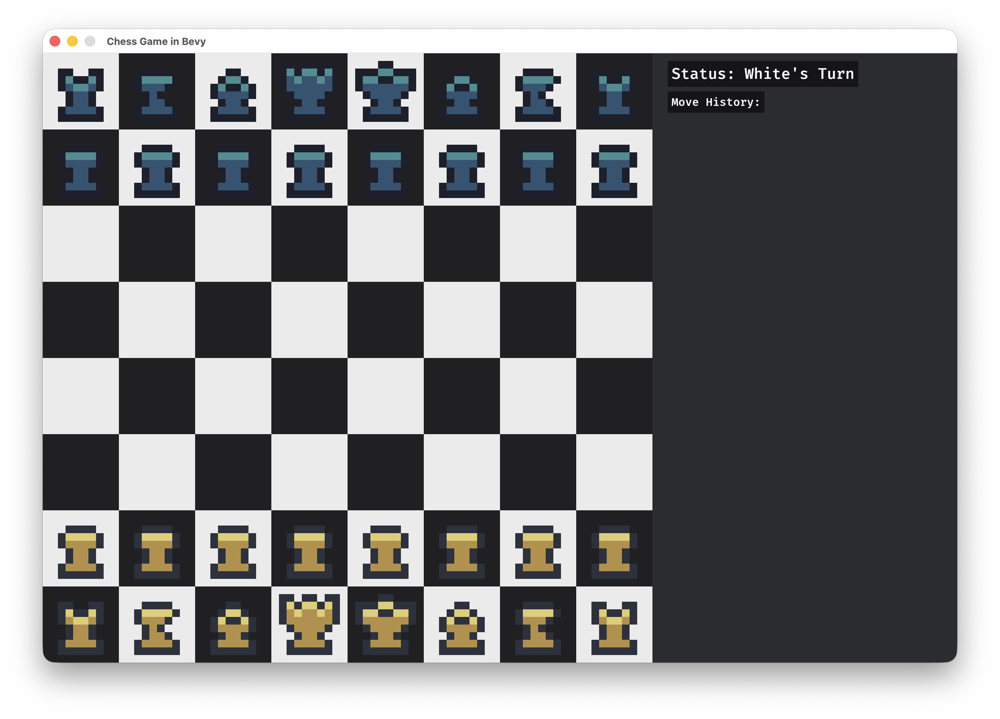

# Rust Bevy Chess Game

A simple 2D chess game built with Rust and the Bevy game engine. This project serves as a learning exercise to explore Bevy's Entity-Component-System (ECS) architecture, asset loading, and basic game setup.



## Features

- **Chess Board**: An 8x8 grid with alternating dark and light tiles, centered on the screen.
- **Chess Pieces**: Initial placement of all 32 pieces (pawns, rooks, knights, bishops, queens, and kings) for both white and black, using sprite-based rendering.
- **Modular Plugins**: The game logic is split into separate plugins for the board and pieces, promoting clean code organization.
- **Window Setup**: Custom window with fixed resolution and title.

## How to Run

1. Clone the repository:
   ```
   git clone https://github.com/RuffLogix/bevy-chess
   cd bevy-chess
   ```

2. Run the game:
   ```
   cargo run
   ```

The game window should open displaying the chess board with pieces in their starting positions.

## Project Structure

- `src/main.rs`: Entry point, sets up the Bevy app and plugins.
- `src/chess_board_plugin.rs`: Handles camera setup and board tile rendering.
- `src/chess_piece_plugin.rs`: Manages piece sprites and initial placement.

## Assets

Chess piece sprites are sourced from [8-Bit Chess Assets](https://cosunosuke.itch.io/8-bit-chess) by Cosu Nosuke.
